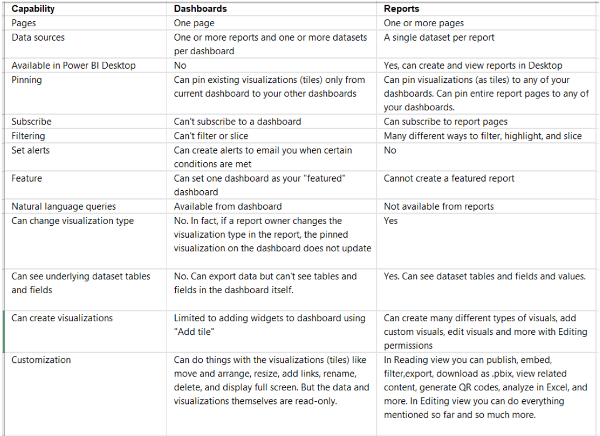

# **Business Intelligence:**

## -  What is Busniess Intelligence ?

### Business intelligence (BI) is the process of transforming data into actionable insights that help a company make strategic and tactical decisions. Is often used to describe a collection of resources that provide fast, easy-to-understand access to data-driven insights about an organization’s current state.

 

## - Why use Business Intelligance:

 

## - Descriptive, Predictive & Prescriptive Analytics:

### **1. Descriptive Analytics:** 

 + ### Descriptive analytics is often considered the first start in data analytics. Descriptive analytics takes massive amounts of historical data and turns it into digestible chunks. It is the process of deciphering what happened in the past and turning it into something interpretable for the past. It can be helpful to understand past behaviors and consider future outcomes. Most descriptive analytics falls in line with statistical modeling.
 > - (Using Visualizations and Reports).

 

### **2. Descriptive Analytics:**
+ ### Businesses can leverage predictive analytics by using statistics, computational modeling and machine learning to identify new sources of data and competitive insights. Using historical data as a guideline with a known set of outcomes, patterns can be found to predict future actions with a surprising degree of accuracy. It enables the business to forecast on what may happen in the future based on probabilities. Think of this data type as information that can be rolled back into multiple channels for the business. We have seen it leveraged in financial modeling, supply chain, logistics and transportation, productivity monitoring, order processing, and more. It offers the business a means to provide actionable insights with your data.

 

### **3. Prescriptive Analytics**
- ### Prescriptive analytics goes even further than descriptive and predictive analytics by allowing a data analyst or scientist to “prescribe” on possible outcomes through data insights, such as past business outcomes, new algorithms, and advanced statistical modeling. You can leverage data and prescriptive analytics to predict trends, future behavior patterns, and finally provide business decision trees to take full advantage of your data insights.

 

------------------------------------

## ***- To learn in Section 4:***

1. ### How to import Data from CSV,Excel and Web files. ✅
2. ### After importing data we do some Visualizing. ✅
3. ### Import Real-time Streaming Data using Power bi and PubNub webpage then create a Dashboard. ✅
4. ### Install SQL Server and import data to Power BI. ✅

5. ### Import Data from OData feed and from Folders in Power BI. ✅

6. ### Dataflow and how to create Gateway and Entitiies. ✅

-------------------------------------

## **What are Dashboards:**
### A Power BI dashboard is a single page, often called a canvas, that uses visualizations to tell a story. Because it is limited to one page, a well-designed dashboard contains only the most-important elements of that story. The visualizations you see on the dashboard are called tiles and are pinned to the dashboard from reports.

 

 

## - **Dashboard Menu**:

 